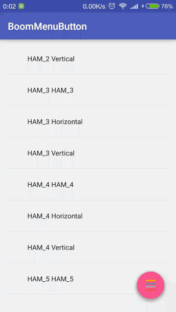
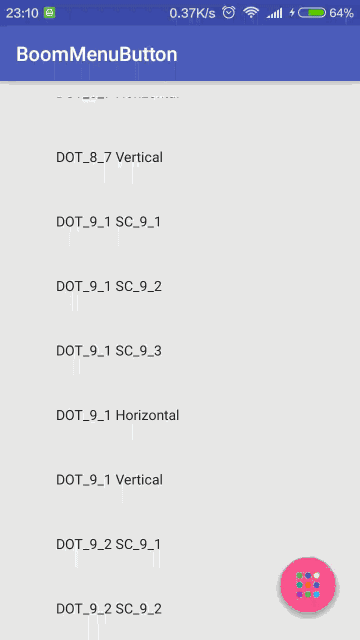

# CustomView
收集自定义View，博客，动画

### 为什么要收集它们

* 有时候，来了一个需求，发现，握草，这个效果不会写啊，这个我记得之前在哪里见过。握草，在哪里啊，印象笔记？有道云笔记？为知笔记？那么多资源怎么找啊，发现，翻阅了半天，还是没找到，哎，我怎么就记得在哪里见过呢?在现在资源过度 **'臃肿'** 的知识时代，好多人尽可能把现有知识往 **'口袋'** 里装，看到太多的例子(@印象笔记 @有道云笔记 @为知笔记)，对这种现象不做评价，但是已笔者亲身经历来说，凡是@xx笔记的，事后是从来没有翻阅过。这种也是变相的满足当时的心理：我擦，这么屌的view，赶紧收藏下！其实，事后早就忘了一干二净了，真正拿出来的实在是少之又少。
	
* 我也在不断总结，如何用高效的方式来系统学习这些优秀的知识，并把它们转化为自己的知识，让自己更有核心竞争力。

##自定义view文章
* [**Android自定义控件三部曲文章**](http://blog.csdn.net/harvic880925/article/details/50995268) 

##动画

###Menu篇
* [Menu篇文章](http://www.jianshu.com/p/e04690cba093)

| 链接 | 说明 | 预览 |
| :--: | :--: | :--: |
| [https://github.com/Hitomis/CircleMenu](https://github.com/Hitomis/CircleMenu) | CircleMenu 是一个精美别致支持定制的圆形菜单，可以有 0 到 8 个子菜单按钮，按钮背景色，图标都可以修改。CircleMenu 比较适合放在屏幕中间，以得到完好的展现。 |  |
| [https://github.com/Nightonke/BoomMenu](https://github.com/Nightonke/BoomMenu)| 多类型炫酷Boom-Menu-Button |    |
|[https://github.com/michaldrabik/TapBarMenu](https://github.com/michaldrabik/TapBarMenu)|Simple library that helps creating a "Tap Bar" menu layout.|   |

###Activity切换篇
| 链接 | 说明 | 预览 |
| :--: | :--: | :--: |
|[https://github.com/githubwing/WingUE](https://github.com/githubwing/WingUE)|仿饿了吗无缝切换搜索动画| |

	
